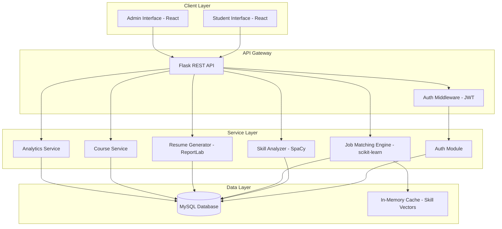
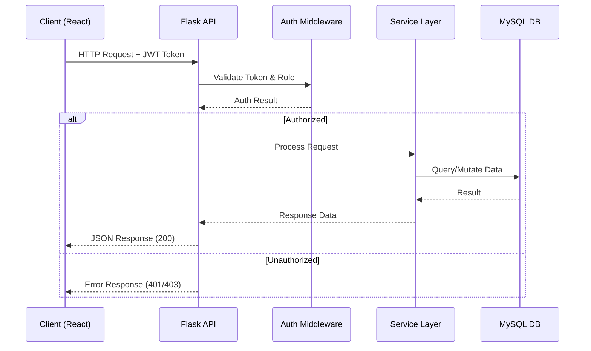
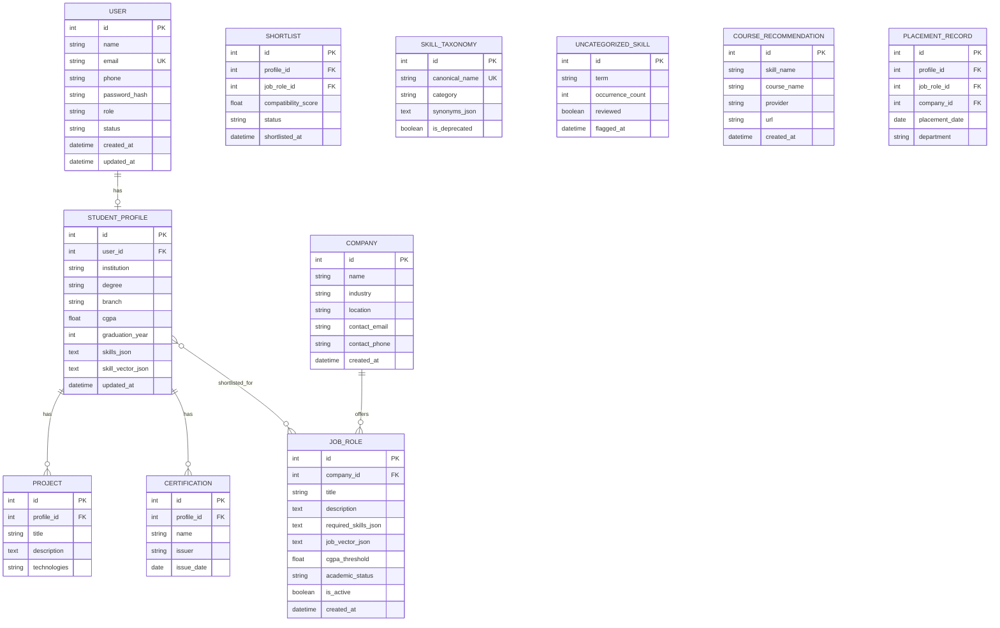

# Design Document: Skill2Job Placement System

## Overview

Skill2Job is a full-stack web application that replaces manual, CGPA-centric campus placement workflows with an AI-driven, skill-aware approach. The system uses NLP for skill extraction and categorization, ML-based vector similarity for job matching, and automated resume generation to streamline the placement process.

The architecture follows a client-server model with a React single-page application communicating with a Flask REST API backend. The backend integrates SpaCy for NLP processing, scikit-learn for vector operations, and MySQL for persistent storage. The system supports three user roles: Student, Placement Officer, and Admin.

### Key Design Decisions

1. **Flask REST API**: Chosen for its lightweight nature and Python ecosystem compatibility with ML/NLP libraries (SpaCy, scikit-learn, NumPy).
2. **React SPA**: Provides responsive UI with component reuse across student and admin interfaces.
3. **MySQL**: Relational database suits the structured nature of student profiles, company records, and job roles with clear foreign key relationships.
4. **Cosine Similarity**: Standard vector similarity metric that works well for sparse skill vectors and is computationally efficient.
5. **SpaCy NLP**: Production-grade NLP library with entity recognition and text processing capabilities suitable for skill extraction.
6. **JWT Sessions**: Stateless authentication tokens with expiry for scalable session management.

## Architecture

### System Architecture Diagram



### Request Flow



### Deployment Architecture

- **Frontend**: Static React build served via Flask or a CDN/Nginx
- **Backend**: Flask application running with Gunicorn (WSGI server)
- **Database**: MySQL server (local or managed instance)
- **NLP Model**: SpaCy model loaded at application startup

## Components and Interfaces

### 1. Auth Module

**Responsibility**: User registration, authentication, session management, and role-based access control.

**Interface**:
```python
class AuthModule:
    def register(self, name: str, email: str, phone: str, password: str) -> dict:
        """Register a new student account. Returns user_id and confirmation."""
        
    def login(self, email: str, password: str) -> dict:
        """Authenticate user. Returns JWT token with role claim."""
        
    def logout(self, token: str) -> bool:
        """Invalidate session token."""
        
    def validate_token(self, token: str) -> dict:
        """Validate JWT and return user info with role."""
        
    def check_permission(self, token: str, required_role: str) -> bool:
        """Check if token holder has the required role."""
```

**Implementation Details**:
- Passwords hashed with bcrypt (unique salt per account)
- JWT tokens with 30-minute expiry
- Role encoded in JWT claims: `student`, `placement_officer`, `admin`
- Token blacklist for logout (stored in memory or Redis)

### 2. Skill Analyzer Module

**Responsibility**: Extract skills from text, normalize to canonical forms, categorize, and generate skill vectors.

**Interface**:
```python
class SkillAnalyzer:
    def extract_skills(self, profile_text: str) -> list[str]:
        """Extract skill terms from free-text using SpaCy NLP."""
        
    def normalize_skill(self, skill_term: str) -> str:
        """Map skill term to canonical name using synonym dictionary."""
        
    def categorize_skills(self, skills: list[str]) -> dict[str, list[str]]:
        """Group skills into predefined categories."""
        
    def generate_skill_vector(self, skills: list[str]) -> np.ndarray:
        """Convert skill list to numerical vector for similarity computation."""
        
    def generate_job_requirement_vector(self, required_skills: list[str]) -> np.ndarray:
        """Convert job skill requirements to numerical vector."""
        
    def flag_unknown_skill(self, skill_term: str) -> None:
        """Flag unrecognized skill for admin review."""
```

**Implementation Details**:
- SpaCy `en_core_web_sm` model for tokenization and entity recognition
- Custom skill taxonomy stored in MySQL with synonym mappings
- Skill vector: binary or TF-IDF weighted vector over the full skill vocabulary
- Vector dimension = size of skill taxonomy

### 3. Job Matching Engine

**Responsibility**: Compute compatibility scores, rank job recommendations, and identify skill gaps.

**Interface**:
```python
class JobMatchingEngine:
    def compute_compatibility(self, skill_vector: np.ndarray, job_vector: np.ndarray) -> float:
        """Compute cosine similarity between student and job vectors. Returns 0.0-1.0."""
        
    def get_recommendations(self, student_id: int, limit: int = 20) -> list[dict]:
        """Get ranked job recommendations for a student. Filters by eligibility."""
        
    def compute_skill_gap(self, skill_vector: np.ndarray, job_vector: np.ndarray) -> list[dict]:
        """Identify missing/weak skills with deficit scores."""
        
    def shortlist_candidates(self, job_role_id: int) -> list[dict]:
        """Filter and rank eligible students for a job role."""
```

**Implementation Details**:
- Cosine similarity via `sklearn.metrics.pairwise.cosine_similarity`
- Eligibility filtering: CGPA threshold, required skills presence, academic status
- Skill gap: element-wise difference where job_vector > skill_vector
- Results cached in memory for repeated queries within a session

### 4. Resume Generator Module

**Responsibility**: Generate professional PDF resumes from student profile data.

**Interface**:
```python
class ResumeGenerator:
    def validate_profile(self, profile: dict) -> tuple[bool, list[str]]:
        """Check if profile has required fields. Returns (valid, missing_fields)."""
        
    def generate_resume(self, student_id: int) -> bytes:
        """Generate PDF resume from student profile. Returns PDF bytes."""
        
    def get_download_filename(self, student_name: str) -> str:
        """Generate filename: Resume_{StudentName}_{Date}.pdf"""
```

**Implementation Details**:
- ReportLab library for PDF generation
- Predefined template with sections: Personal Info, Academic Details, Skills, Projects, Certifications
- Profile data fetched from DB at generation time (always reflects latest data)

### 5. Analytics Service

**Responsibility**: Aggregate and compute placement statistics.

**Interface**:
```python
class AnalyticsService:
    def get_overview_stats(self) -> dict:
        """Total students, placed students, companies, placement percentage."""
        
    def get_department_breakdown(self, date_from: date = None, date_to: date = None) -> list[dict]:
        """Placement counts/percentages by department."""
        
    def get_company_breakdown(self, date_from: date = None, date_to: date = None) -> list[dict]:
        """Students placed per company."""
        
    def get_skill_demand(self) -> list[dict]:
        """Most frequently required skills across active job roles."""
```

### REST API Endpoints

| Method | Endpoint | Role | Description |
|--------|----------|------|-------------|
| POST | `/api/auth/register` | Public | Student registration |
| POST | `/api/auth/login` | Public | User login |
| POST | `/api/auth/logout` | Any | Logout / invalidate token |
| GET | `/api/profile` | Student | Get own profile |
| PUT | `/api/profile` | Student | Update profile |
| POST | `/api/resume/generate` | Student | Generate resume PDF |
| GET | `/api/resume/download` | Student | Download generated resume |
| GET | `/api/skills/analysis` | Student | Get skill categorization |
| GET | `/api/jobs/recommendations` | Student | Get job recommendations |
| GET | `/api/jobs/{id}/skill-gap` | Student | Get skill gap for a job |
| GET | `/api/jobs/{id}/courses` | Student | Get course recommendations |
| GET | `/api/admin/companies` | Officer/Admin | List companies |
| POST | `/api/admin/companies` | Officer/Admin | Add company |
| PUT | `/api/admin/companies/{id}` | Officer/Admin | Update company |
| POST | `/api/admin/jobs` | Officer/Admin | Add job role |
| PUT | `/api/admin/jobs/{id}` | Officer/Admin | Update job role |
| DELETE | `/api/admin/jobs/{id}` | Officer/Admin | Delete job role |
| GET | `/api/admin/jobs/{id}/shortlist` | Officer/Admin | Get candidate shortlist |
| POST | `/api/admin/jobs/{id}/shortlist` | Officer/Admin | Mark candidates shortlisted |
| GET | `/api/admin/analytics` | Officer/Admin | Get placement analytics |
| GET | `/api/admin/users` | Admin | List users (paginated) |
| POST | `/api/admin/users` | Admin | Create user account |
| PUT | `/api/admin/users/{id}/status` | Admin | Activate/deactivate user |
| GET | `/api/admin/skills/taxonomy` | Admin | Get skill taxonomy |
| POST | `/api/admin/skills/taxonomy` | Admin | Add skill to taxonomy |
| PUT | `/api/admin/skills/taxonomy/{id}` | Admin | Update skill entry |
| DELETE | `/api/admin/skills/taxonomy/{id}` | Admin | Deprecate skill |
| GET | `/api/admin/skills/uncategorized` | Admin | Get flagged skills |
| POST | `/api/admin/courses` | Officer/Admin | Add course recommendation |

## Data Models

### Entity Relationship Diagram



### Key Data Structures

**Skill Vector** (stored as JSON in `skill_vector_json`):
```json
{
    "vector": [0.0, 1.0, 1.0, 0.0, 1.0, ...],
    "skill_index": {"python": 0, "javascript": 1, "react": 2, ...},
    "version": "1.0"
}
```

**Job Requirement Vector** (stored as JSON in `job_vector_json`):
```json
{
    "vector": [1.0, 1.0, 0.0, 1.0, 0.0, ...],
    "skill_index": {"python": 0, "javascript": 1, "react": 2, ...},
    "version": "1.0"
}
```

**Skill Gap Response**:
```json
{
    "job_role_id": 5,
    "gaps": [
        {"skill": "Docker", "deficit_score": 1.0},
        {"skill": "AWS", "deficit_score": 0.7}
    ],
    "coverage_percentage": 75.0
}
```

### Database Indexes

| Table | Index | Purpose |
|-------|-------|---------|
| `user` | `idx_user_email` (UNIQUE) | Fast login lookup |
| `student_profile` | `idx_profile_user_id` | Profile by user |
| `job_role` | `idx_job_company_id` | Jobs by company |
| `job_role` | `idx_job_active` | Active job filtering |
| `skill_taxonomy` | `idx_skill_canonical` (UNIQUE) | Skill normalization |
| `shortlist` | `idx_shortlist_job` | Candidates per job |
| `placement_record` | `idx_placement_date` | Date range queries |
| `placement_record` | `idx_placement_dept` | Department analytics |

## Correctness Properties

*A property is a characteristic or behavior that should hold true across all valid executions of a system—essentially, a formal statement about what the system should do. Properties serve as the bridge between human-readable specifications and machine-verifiable correctness guarantees.*

### Property 1: Input Validation Rejects Invalid Data

*For any* form submission containing invalid data (invalid email format, password shorter than 8 characters, CGPA outside [0.0, 10.0], or missing required fields), the system SHALL reject the submission and return a response identifying the specific invalid fields.

**Validates: Requirements 1.3, 1.4, 3.5, 3.6, 9.6, 14.1**

### Property 2: Password Storage Security

*For any* password provided during registration, the stored hash SHALL NOT equal the plaintext password, and hashing the same password for two different accounts SHALL produce different stored values (due to unique salts).

**Validates: Requirements 1.5**

### Property 3: Duplicate Email Rejection

*For any* email address that already exists in the database, attempting to register a new account with that email SHALL be rejected.

**Validates: Requirements 1.2**

### Property 4: Role-Based Access Control Enforcement

*For any* user with a given role and any API endpoint, access SHALL be granted only if the endpoint is permitted for that role (Students cannot access Officer/Admin endpoints, Officers cannot access Admin-only endpoints).

**Validates: Requirements 2.3, 16.2**

### Property 5: Invalid Token Rejection

*For any* expired, malformed, or invalid session token, API requests SHALL return an authentication error (401).

**Validates: Requirements 2.6**

### Property 6: Profile Data Persistence Round-Trip

*For any* valid student profile data (academic details, skills list, project entries), saving the profile and then retrieving it SHALL produce data equivalent to what was submitted.

**Validates: Requirements 3.1, 3.2, 3.3, 3.4**

### Property 7: Resume Generation Completeness

*For any* complete student profile (all required fields present), resume generation SHALL produce a valid PDF document containing sections for personal information, academic details, technical skills, projects, and certifications with data matching the current profile.

**Validates: Requirements 4.1, 4.2, 4.5, 4.6**

### Property 8: Resume Validation Rejects Incomplete Profiles

*For any* student profile missing one or more required fields (name, institution, degree, skills), resume generation SHALL fail and the error SHALL list exactly the missing fields.

**Validates: Requirements 4.3**

### Property 9: Skill Normalization Consistency

*For any* skill synonym defined in the taxonomy, the Skill_Analyzer SHALL normalize it to the same canonical name as the base skill term.

**Validates: Requirements 5.5, 13.2**

### Property 10: Skill Vector Dimensionality and Categorization

*For any* valid skill list, the generated Skill_Vector SHALL have dimension equal to the taxonomy size, and each extracted skill SHALL be assigned to exactly one predefined category.

**Validates: Requirements 5.2, 5.3**

### Property 11: Unknown Skills Are Flagged

*For any* skill term not present in the system's skill taxonomy, the Skill_Analyzer SHALL flag it as uncategorized for admin review.

**Validates: Requirements 5.4**

### Property 12: Cosine Similarity Correctness

*For any* two skill vectors, the Compatibility_Score computed by the Job_Matching_Engine SHALL equal the cosine similarity computed by a reference implementation (sklearn cosine_similarity).

**Validates: Requirements 6.2**

### Property 13: Job Recommendations Sorted Descending

*For any* set of job recommendations returned to a student, the Compatibility_Scores SHALL be in non-increasing order (each score >= the next).

**Validates: Requirements 6.3**

### Property 14: Eligibility Filtering

*For any* student and job role where the student does NOT meet the eligibility criteria (CGPA below threshold or missing required skills), that job role SHALL NOT appear in the student's recommendations or shortlist.

**Validates: Requirements 6.6, 10.1**

### Property 15: Skill Gap Correctness

*For any* student Skill_Vector and Job_Requirement_Vector, the computed Skill_Gap SHALL contain exactly those skills where the job requires the skill but the student vector has a zero or lower value, with each deficit score in [0.0, 1.0], sorted by deficit descending.

**Validates: Requirements 7.1, 7.2, 7.3**

### Property 16: Full Coverage Detection

*For any* student Skill_Vector that satisfies all dimensions of a Job_Requirement_Vector (no gaps), the Skill_Gap result SHALL be empty.

**Validates: Requirements 7.4**

### Property 17: Skill Vector Serialization Round-Trip

*For any* valid Skill_Vector or Job_Requirement_Vector, serializing to JSON and deserializing back SHALL produce a numerically equivalent vector.

**Validates: Requirements 17.1, 17.2**

### Property 18: Self-Similarity Identity

*For any* non-zero Skill_Vector, computing the Compatibility_Score of the vector against itself SHALL produce a score of 1.0.

**Validates: Requirements 17.3**

### Property 19: Compatibility Score Symmetry

*For any* Student Skill_Vector A and Job_Requirement_Vector B, the Compatibility_Score of A against B SHALL equal the Compatibility_Score of B against A.

**Validates: Requirements 17.4**

### Property 20: Profile Serialization Round-Trip

*For any* valid Student profile object, serializing to JSON and deserializing back SHALL produce an equivalent object with no data loss.

**Validates: Requirements 18.1**

### Property 21: Resume Data Completeness (No Data Loss)

*For any* valid Student profile, generating a resume and extracting structured data from it SHALL contain all skills, projects, and academic details present in the original profile.

**Validates: Requirements 18.2**

### Property 22: Input Sanitization

*For any* user input containing SQL injection patterns or XSS payloads, the system SHALL sanitize or reject the input before processing.

**Validates: Requirements 16.3**

## Error Handling

### Error Response Format

All API errors follow a consistent JSON structure:

```json
{
    "error": {
        "code": "VALIDATION_ERROR",
        "message": "Human-readable error description",
        "fields": {
            "email": "Invalid email format",
            "password": "Must be at least 8 characters"
        }
    }
}
```

### Error Categories

| Error Code | HTTP Status | Description |
|-----------|-------------|-------------|
| `VALIDATION_ERROR` | 400 | Input validation failure with field details |
| `AUTHENTICATION_ERROR` | 401 | Invalid/expired token or credentials |
| `AUTHORIZATION_ERROR` | 403 | Insufficient role permissions |
| `NOT_FOUND` | 404 | Requested resource does not exist |
| `CONFLICT` | 409 | Duplicate resource (e.g., email already registered) |
| `PROCESSING_ERROR` | 500 | Internal processing failure (Skill_Analyzer, Job_Matching_Engine) |
| `SERVICE_UNAVAILABLE` | 503 | Database or external service unreachable |

### Error Handling Strategy

1. **Client-Side Validation**: React forms validate inputs before submission (email format, required fields, CGPA range). Provides immediate feedback.

2. **Server-Side Validation**: Flask validates all inputs regardless of client validation. Uses schema validation (e.g., marshmallow or pydantic) for request bodies.

3. **Database Errors**: Caught at the service layer. Connection failures return 503 with a user-friendly message. Constraint violations (duplicate email) return 409.

4. **Processing Errors**: Skill_Analyzer and Job_Matching_Engine errors are caught, logged with full context (module, input summary, error type, timestamp), and return 500 with a generic message to the user.

5. **Authentication Errors**: Generic "Invalid credentials" message for login failures (never reveals whether email or password was wrong). Expired tokens return 401.

6. **Logging**: All server errors logged with structured format including timestamp, module, error type, request context, and stack trace. Logs stored in rotating files.

### Graceful Degradation

- If Skill_Analyzer fails, profile is saved without skill analysis (analysis retried on next profile view)
- If Job_Matching_Engine fails, student sees cached recommendations or a "temporarily unavailable" message
- If Resume_Generator fails, student receives error with option to retry

## Testing Strategy

### Testing Approach

The system uses a dual testing approach combining unit tests with property-based tests for comprehensive coverage.

### Property-Based Testing

**Library**: [Hypothesis](https://hypothesis.readthedocs.io/) (Python PBT library)

**Configuration**:
- Minimum 100 iterations per property test
- Each test tagged with: `Feature: skill2job-placement-system, Property {number}: {property_text}`

**Properties to implement** (from Correctness Properties section):
- Properties 1-22 as defined above
- Focus areas: vector operations (Properties 12, 17-19), serialization (Properties 6, 17, 20), validation (Properties 1, 3, 8), access control (Property 4)

**Generator Strategy**:
- Custom Hypothesis strategies for Student profiles, skill lists, skill vectors, job roles
- Edge cases covered by generators: empty skill lists, maximum-length strings, unicode characters, boundary CGPA values (0.0, 10.0), zero vectors

### Unit Testing

**Library**: pytest

**Focus areas**:
- Specific examples for CRUD operations (Requirements 9, 10, 12, 13)
- Edge cases: empty database, no active jobs, no courses for a skill
- Integration points: API endpoint responses contain all required fields
- Session management: login, logout, expiry behavior

### Integration Testing

**Focus areas**:
- Database connectivity and query correctness
- Analytics aggregation (Requirement 11)
- Dynamic configuration updates (Requirements 8.4, 12.3)
- End-to-end flows: registration → profile → skill analysis → recommendations

### Frontend Testing

**Library**: Jest + React Testing Library

**Focus areas**:
- Component rendering with various data states
- Form validation behavior
- API response handling and error display
- Role-based UI element visibility

### Test Organization

```
tests/
├── unit/
│   ├── test_auth.py
│   ├── test_skill_analyzer.py
│   ├── test_job_matching.py
│   ├── test_resume_generator.py
│   └── test_analytics.py
├── property/
│   ├── test_validation_properties.py
│   ├── test_vector_properties.py
│   ├── test_serialization_properties.py
│   ├── test_matching_properties.py
│   └── test_security_properties.py
├── integration/
│   ├── test_api_endpoints.py
│   ├── test_database.py
│   └── test_end_to_end.py
└── frontend/
    ├── components/
    └── pages/
```

